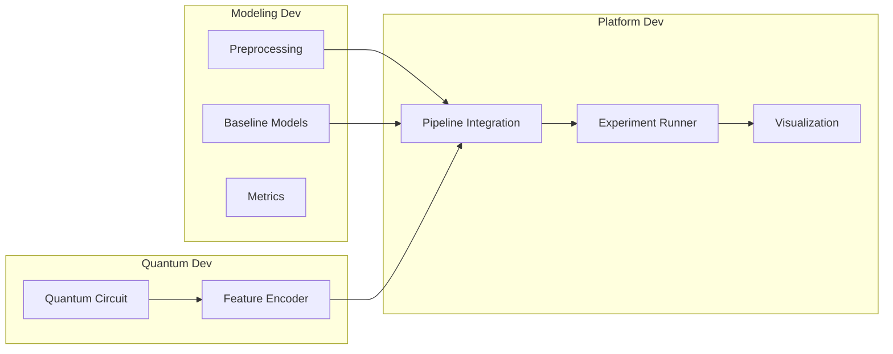

# QIG Hackathon 2026

Repository for a hybrid classical + quantum option-pricing workflow.

## Pipeline

The project is organized around the following development pipeline.



## Stage Responsibilities

### Modeling Dev
- `Preprocessing`: load market data, clean it, build features, and prepare train/validation/test splits.
- `Baseline Models`: implement classical references to compare against the hybrid approach.
- `Metrics`: define shared evaluation metrics for all experiments (for example MAE, RMSE, R2).

### Quantum Dev
- `Quantum Circuit`: design and validate the quantum circuit topology.
- `Feature Encoder`: encode classical inputs into quantum-ready features and expose them in a reusable interface.

### Platform Dev
- `Pipeline Integration`: join classical preprocessing, quantum features, and model training into one runnable flow.
- `Experiment Runner`: execute reproducible runs using config files and track outputs.
- `Visualization`: generate result plots and comparison dashboards.

## Repository Layout

Current scaffold:

```text
qig-hackathon/
|-- DATASETS/
|   |-- train.xlsx
|   |-- test_template.xlsx
|   `-- sample_Simulated_Swaption_Price.xlsx
|
|-- configs/
|   |-- baseline.yaml          # lr, epochs, model_type: linear/mlp
|   `-- hybrid.yaml            # lr, epochs, n_modes, n_photons, encoder_type
|
|-- src/
|   |-- data/
|   |   |-- __init__.py
|   |   |-- loader.py          # load_data() — lê o .xlsx
|   |   |-- preprocessing.py   # melt, normalize, feature engineering
|   |   `-- splits.py          # train/val/test split → DataLoaders
|   |
|   |-- classical/
|   |   |-- __init__.py
|   |   |-- linear.py          # Ridge / Linear Regression (sklearn)
|   |   `-- mlp.py             # MLP em PyTorch (seu baseline principal)
|   |
|   |-- quantum/
|   |   |-- __init__.py
|   |   |-- circuit.py         # definição do circuito MerLin (Quantum Dev)
|   |   `-- encoder.py         # encode dados → input quântico (Quantum Dev)
|   |
|   |-- hybrid/
|   |   |-- __init__.py
|   |   |-- model.py           # QRC: encoder quântico + readout clássico
|   |   `-- trainer.py         # training loop, early stopping, checkpoint
|   |
|   `-- eval/
|       |-- __init__.py
|       |-- metrics.py         # MAE, RMSE, R² — usado por todos
|       `-- visualize.py       # curvas de loss, pred vs real, term surface
|
|-- run.py                     # entry point: carrega config, roda experimento
|-- Makefile                   # make baseline | make hybrid | make eval
`-- requirements.txt
```

---

**O fluxo de dados pelo código:**
```
loader.py → preprocessing.py → splits.py
                                    │
                    ┌───────────────┴───────────────┐
                    ▼                               ▼
              classical/mlp.py              hybrid/model.py
              (seu baseline)          (encoder.py + trainer.py)
                    │                               │
                    └───────────────┬───────────────┘
                                    ▼
                              eval/metrics.py
                              eval/visualize.py

Suggested mapping to the pipeline:

- `src/data` -> `Preprocessing`
- `src/classical` -> `Baseline Models`
- `src/eval` -> `Metrics` and `Visualization`
- `src/quantum` -> `Quantum Circuit` and `Feature Encoder`
- `src/hybrid` -> `Pipeline Integration` and `Experiment Runner`

## How To Run

Install dependencies:

```bash
python -m venv .venv
. .venv/bin/activate
pip install -r requirements.txt
```

Run experiments:

```bash
python run.py --config configs/baseline.yaml
python run.py --config configs/hybrid.yaml
```

Or with Make:

```bash
make baseline
make hybrid
```

## Implementation Checklist

- [ ] Preprocessing pipeline in `src/data`
- [ ] Baseline models in `src/classical`
- [ ] Quantum circuit + encoder in `src/quantum`
- [ ] Integrated training pipeline in `src/hybrid`
- [ ] Metrics + visual reports in `src/eval`
- [ ] Config-driven runs from `run.py`
