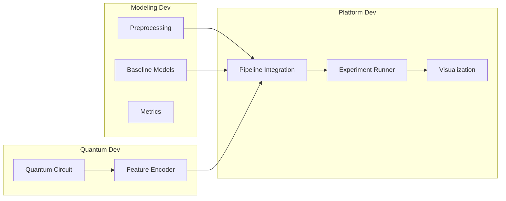
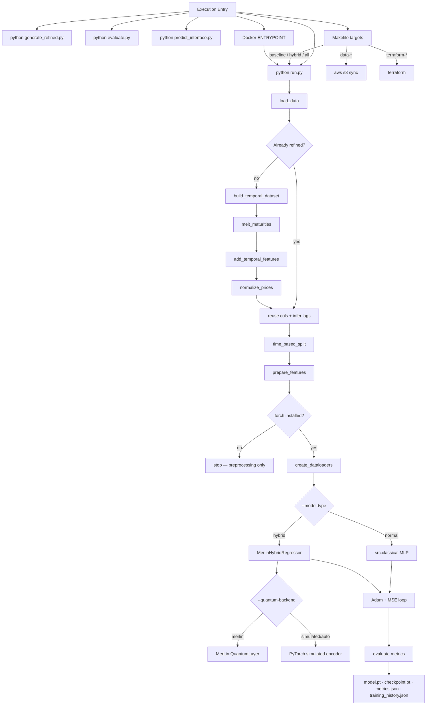

# QuTech · QIG Hackathon 2026

<p align="center">
  
  
  
  
  
</p>

<p align="center">
  <strong>Hybrid classical + quantum workflow for interest-rate swaption pricing.</strong><br>
  Temporal feature engineering · MLP baselines · MerLin photonic quantum encoder · Reproducible experiments
</p>

---

## Table of Contents

1. [Overview](#overview)
2. [Architecture](#architecture)
3. [Repository Layout](#repository-layout)
4. [Stage Responsibilities](#stage-responsibilities)
5. [Setup](#setup)
6. [Dataset](#dataset)
7. [Running the Pipeline](#running-the-pipeline)
8. [CLI Reference](#cli-reference)
9. [Module Reference](#module-reference)
10. [Outputs & Artifacts](#outputs--artifacts)
11. [Implementation Status](#implementation-status)
12. [Further Reading](#further-reading)

---

## Overview

This project implements a full ML pipeline for pricing interest-rate swaptions. The central research question is whether a **photonic quantum encoder** (MerLin) can extract richer representations from temporal financial features than a purely classical MLP — improving pricing accuracy while remaining differentiable end-to-end.

### What the pipeline does

| Step | Description |
|---|---|
| **Ingest** | Load raw swaption price matrices (`.xlsx` / `.csv`) from local disk or S3 |
| **Reshape** | Melt wide maturity columns into a long time-series format |
| **Engineer** | Build lag features, rolling statistics, and returns per tenor-maturity pair |
| **Split** | Chronological train / validation split (no data leakage) |
| **Train** | Classical MLP baseline or MerLin hybrid quantum-classical regressor |
| **Evaluate** | MAE, RMSE, R² on the held-out validation set |
| **Visualize** | Loss curves, predicted vs. actual scatter, and term-structure surface plots |

### Key capabilities

- **Temporal feature engineering** — lags, rolling mean/std, 1-step diff and log-return
- **Classical baseline** — Ridge regression and a configurable deep MLP (PyTorch)
- **Hybrid quantum model** — MerLin photonic encoder + classical MLP readout head
- **Reproducible experiments** — YAML config files or full CLI control
- **Flexible data loading** — local `.xlsx` / `.csv` or `s3://bucket/prefix`
- **Scalable training** — CPU multi-threading, single-GPU, and multi-GPU (DataParallel)
- **Graceful degradation** — preprocessing and splits run even when `torch` is absent

---

## Architecture

### Development pipeline


### Training flow — `run.py`


---

## Repository Layout
```text
qig-hackathon/
├── DATASETS/
│   ├── train.xlsx                          # Raw training swaption prices
│   ├── test_template.xlsx                  # Inference template (no labels)
│   └── sample_Simulated_Swaption_Price.xlsx
│
├── configs/
│   ├── baseline.yaml                       # lr, epochs, model_type: linear | mlp
│   └── hybrid.yaml                         # lr, epochs, n_modes, n_photons, encoder_type
│
├── src/
│   ├── data/
│   │   ├── loader.py           # load_data() — .xlsx / .csv / s3://
│   │   ├── preprocessing.py    # melt, temporal features, normalize, prepare
│   │   └── splits.py           # chronological split → DataLoaders
│   │
│   ├── classical/
│   │   ├── linear.py           # Ridge / Linear Regression (sklearn)
│   │   └── mlp.py              # Configurable MLP (PyTorch)
│   │
│   ├── quantum/
│   │   ├── circuit.py          # MerLin photonic circuit definition
│   │   └── encoder.py          # Classical → quantum feature mapping
│   │
│   ├── hybrid/
│   │   ├── model.py            # MerlinHybridRegressor: encoder + readout head
│   │   └── trainer.py          # Training loop, early stopping, checkpointing
│   │
│   └── eval/
│       ├── metrics.py          # MAE, RMSE, R² — shared across all models
│       └── visualize.py        # Loss curves, scatter plots, surface plots
│
├── run.py                      # Main entry point (training)
├── generate_refined.py         # Build & optionally upload refined dataset
├── evaluate.py                 # Evaluate a saved checkpoint
├── predict_interface.py        # Batch inference → predictions.csv
├── Makefile                    # make baseline | hybrid | eval | data | terraform-*
└── requirements.txt
```

**Pipeline → source mapping:**

| Pipeline stage | Owner | Source path |
|---|---|---|
| Preprocessing | Modeling Dev | `src/data/` |
| Baseline Models | Modeling Dev | `src/classical/` |
| Metrics | Modeling Dev | `src/eval/metrics.py` |
| Quantum Circuit | Quantum Dev | `src/quantum/circuit.py` |
| Feature Encoder | Quantum Dev | `src/quantum/encoder.py` |
| Pipeline Integration | Platform Dev | `src/hybrid/` |
| Experiment Runner | Platform Dev | `run.py`, `configs/` |
| Visualization | Platform Dev | `src/eval/visualize.py` |

---

## Stage Responsibilities

### Modeling Dev

| Module | Responsibility |
|---|---|
| `src/data/loader.py` | Ingest swaption price matrices from local files or S3; parse dates; expose `load_train_data` and `load_test_template` wrappers |
| `src/data/preprocessing.py` | Melt wide-format maturity columns; engineer lag, diff, return, and rolling features; normalize prices |
| `src/data/splits.py` | Chronological train / val split by date with no leakage; wrap arrays in PyTorch `DataLoader`s |
| `src/classical/linear.py` | Ridge regression reference — fast to fit, interpretable coefficients |
| `src/classical/mlp.py` | Deep MLP baseline; configurable depth and width; Adam optimizer; primary classical comparator |
| `src/eval/metrics.py` | MAE, RMSE, R² computed consistently across every model variant |

### Quantum Dev

| Module | Responsibility |
|---|---|
| `src/quantum/circuit.py` | Define and validate the MerLin photonic circuit topology (modes, photons, depth) |
| `src/quantum/encoder.py` | Map normalized classical feature vectors to quantum-ready inputs via `angle` or `amplitude` encoding; expose a stable `encode(x)` interface |

### Platform Dev

| Module | Responsibility |
|---|---|
| `src/hybrid/model.py` | Compose quantum encoder + classical MLP readout into `MerlinHybridRegressor`; handle `merlin` / `simulated` / `auto` backend selection |
| `src/hybrid/trainer.py` | Adam + MSE training loop; early stopping on val loss; checkpoint saving |
| `run.py` | Unified CLI entry point: config loading, full training flow |
| `evaluate.py` | Load checkpoint and report metrics on any split |
| `predict_interface.py` | Batch inference with denormalization → `predictions.csv` |
| `src/eval/visualize.py` | Loss curves, predicted vs. actual scatter, term-structure surface plots |

---

## Setup

### Requirements

- Python 3.10+
- PyTorch 2.x *(optional — preprocessing runs without it)*
- `scikit-learn` *(optional — local `StandardScaler` fallback is used if absent)*
- `boto3` *(optional — only needed for private S3 buckets)*

### Linux / macOS
```bash
python -m venv .venv
source .venv/bin/activate
pip install -r requirements.txt
```

### Windows PowerShell
```powershell
python -m venv .venv
.venv\Scripts\Activate.ps1
pip install -r requirements.txt
```

> **Smoke test:** `python run.py --train-path DATASETS/train.xlsx --model-type normal` — confirms the full pipeline works end-to-end immediately after setup.

---

## Dataset

The public S3 bucket is organized as:
```text
s3://<DATASET_BUCKET>/
  raw/v1/        <- immutable raw swaption price matrices
  refined/v1/    <- temporally engineered dataset (may be updated)
```

### Download locally
```bash
make data          # sync both splits → data/raw/ and data/refined/
make data-raw      # raw only
make data-refined  # refined only
```

Configure via environment variables:
```bash
export DATASET_BUCKET=raw-721094557902-us-east-1
export AWS_REGION=us-east-1
```

> For **private** buckets, install `boto3` and configure AWS credentials (`aws configure` or environment variables). Public buckets require no credentials.

---

## Running the Pipeline

### Quick start
```bash
# 1. Build refined dataset from local raw files
python generate_refined.py \
  --data-dir DATASETS \
  --output-local results/refined_train.csv

# 2. Train the classical MLP baseline
python run.py \
  --train-path results/refined_train.csv \
  --lags 1,5,10 \
  --rolling-windows 5,20 \
  --val-fraction 0.2
```

From S3:
```bash
python generate_refined.py \
  --data-dir s3://raw-721094557902-us-east-1 \
  --output-local results/refined_train.csv
```

### Hybrid quantum model
```bash
# MerLin backend
python run.py \
  --model-type hybrid --quantum-backend merlin \
  --n-modes 4 --n-photons 2 --quantum-depth 2

# Longer run with per-epoch logging
python run.py \
  --model-type hybrid --quantum-backend merlin \
  --epochs 120 --lr 0.0005 --log-every 1
```

### Training parallelism
```bash
# CPU multi-threading
python run.py --train-path results/refined_train.csv --epochs 20 \
  --device cpu --num-workers 4 --persistent-workers \
  --prefetch-factor 2 --torch-num-threads 8

# Single GPU
python run.py --train-path results/refined_train.csv --epochs 20 \
  --device cuda --num-workers 4 --pin-memory --persistent-workers

# Multi-GPU (requires >= 2 CUDA GPUs)
python run.py --train-path results/refined_train.csv --epochs 20 \
  --device cuda --data-parallel --num-workers 8 \
  --pin-memory --persistent-workers
```

### Config-file driven runs
```bash
python run.py --config configs/baseline.yaml
python run.py --config configs/hybrid.yaml
```

### Evaluate a checkpoint
```bash
python evaluate.py \
  --checkpoint results/checkpoint.pt \
  --data-dir DATASETS --filename train.xlsx \
  --val-fraction 0.2
```

### Batch inference
```bash
python predict_interface.py \
  --checkpoint results/checkpoint.pt \
  --data-dir DATASETS --filename test_template.xlsx \
  --output results/predictions.csv
```

### Upload refined dataset to S3
```bash
python generate_refined.py \
  --data-dir DATASETS \
  --output-local results/refined_train.csv \
  --s3-destination s3://raw-721094557902-us-east-1/refined/refined_train.csv \
  --s3-format csv
```

### Expected output
```
Loaded 1000 rows from DATASETS/train.xlsx
Maturities found: [0.083, 0.166, 0.25, ...]
Temporal features added: price_lag_1, price_lag_5, price_lag_10, ...
Split date: 2049-08-01 | Train: 800 rows | Val: 200 rows
DataLoaders ready — Train batches: 25 | Val batches: 7
```

---

## CLI Reference

### Data & paths

| Parameter | Default | Description |
|---|---|---|
| `--data-dir` | `DATASETS` | Fallback folder / S3 prefix when `--train-path` is a bare filename |
| `--train-path` | `results/refined_train.csv` | Training file — local path or `s3://.../file` |
| `--config` | *(none)* | YAML config file; CLI flags override config values |

### Feature engineering

| Parameter | Default | Description |
|---|---|---|
| `--lags` | `1,5,10` | Comma-separated lag steps (generates `price_lag_N` columns) |
| `--rolling-windows` | `5,20` | Window sizes for rolling mean / std |
| `--val-fraction` | `0.2` | Chronological validation fraction |

### Training

| Parameter | Default | Description |
|---|---|---|
| `--epochs` | `auto` | Training epochs; `auto` uses total training batch count |
| `--lr` | `0.001` | Adam learning rate |
| `--batch-size` | `32` | DataLoader batch size |
| `--log-every` | `5` | Epoch interval for metric logging |

### Hardware & parallelism

| Parameter | Default | Description |
|---|---|---|
| `--device` | `auto` | `auto`, `cpu`, `cuda`, or `mps` |
| `--num-workers` | `0` | DataLoader worker processes |
| `--pin-memory` | `False` | Pinned host memory for faster CPU → GPU transfers |
| `--persistent-workers` | `False` | Keep workers alive between epochs (requires `--num-workers > 0`) |
| `--prefetch-factor` | `2` | Batches prefetched per worker (requires `--num-workers > 0`) |
| `--data-parallel` | `False` | `torch.nn.DataParallel` across all visible CUDA GPUs |
| `--torch-num-threads` | `0` | CPU thread count (`0` keeps PyTorch default) |

### Model selection

| Parameter | Default | Description |
|---|---|---|
| `--model-type` | `normal` | `normal` (MLP) or `hybrid` (MerLin + readout head) |

### Quantum parameters *(hybrid only)*

| Parameter | Default | Description |
|---|---|---|
| `--quantum-backend` | `merlin` | `merlin`, `simulated`, or `auto` (falls back if MerLin unavailable) |
| `--n-modes` | `4` | Number of photonic modes |
| `--n-photons` | `2` | Number of photons |
| `--quantum-depth` | `2` | Trainable circuit depth |
| `--encoding-type` | `angle` | Feature encoding: `angle` or `amplitude` |
| `--measurement` | `probs` | MerLin measurement strategy |

---

## Module Reference

### `src/data/loader.py`

| Function | Signature | Description |
|---|---|---|
| `load_data` | `(path, parse_dates=True, ...)` | Loads `.xlsx`, `.xls`, or `.csv` from local path or `s3://bucket/prefix` |
| `load_train_data` | `(data_dir, filename, ...)` | Convenience wrapper for the training set |
| `load_test_template` | `(data_dir, filename, ...)` | Convenience wrapper for the inference template |

### `src/data/preprocessing.py`

Full temporal preprocessing pipeline, applied in order:

| Step | Function | Output columns added |
|---|---|---|
| 1 | `melt_maturities(df)` | `tenor`, `maturity`, `price` — wide → long format |
| 2 | `add_temporal_features(df, lags, windows)` | `price_lag_N`, `price_diff_1`, `price_return_1`, `price_roll_mean_W`, `price_roll_std_W`, `time_idx_days` |
| 3 | `normalize_prices(df)` | `price` z-scored; sklearn fallback if absent |
| 4 | `prepare_features(df)` | Final ordered feature matrix |
| 5 | `build_temporal_dataset(df, lags, windows)` | Orchestrates steps 1–4 end-to-end |

### `src/data/splits.py`

| Function | Description |
|---|---|
| `time_based_split(df, val_fraction)` | Sorts by `Date`; last `val_fraction` rows become validation — strictly no leakage |
| `create_dataloaders(X_train, y_train, X_val, y_val, ...)` | Wraps NumPy arrays in `torch.utils.data.DataLoader`; PyTorch import is deferred |

### `src/classical/`

| File | Class | Description |
|---|---|---|
| `linear.py` | `RidgeBaseline` | Thin sklearn wrapper; fits in seconds; useful sanity-check floor |
| `mlp.py` | `MLP` | Configurable feedforward network; default 3 hidden layers, ReLU, BatchNorm |

### `src/quantum/`

| File | Description |
|---|---|
| `circuit.py` | MerLin photonic circuit topology — configures modes, photons, and trainable layer count |
| `encoder.py` | Maps normalized vectors to circuit inputs via `angle` (Rx/Ry rotations) or `amplitude` encoding; exposes `encode(x)` |

### `src/hybrid/`

| File | Class | Description |
|---|---|---|
| `model.py` | `MerlinHybridRegressor` | Composes encoder → MerLin QuantumLayer → classical MLP readout; backend selected at init |
| `trainer.py` | `HybridTrainer` | Adam + MSE loop; early stopping on val loss; checkpoint saving |

### `src/eval/`

| File | Functions | Description |
|---|---|---|
| `metrics.py` | `mae`, `rmse`, `r2` | Accept NumPy arrays; shared across classical and hybrid experiments |
| `visualize.py` | `plot_loss_curves`, `plot_pred_vs_actual`, `plot_term_surface` | Saves `.png` charts to `results/` |

---

## Outputs & Artifacts

After a successful run, the following files are written to `results/`:

| File | Generated by | Contents |
|---|---|---|
| `model.pt` | `trainer.py` | Full model state dict |
| `checkpoint.pt` | `trainer.py` | Model + optimizer state + epoch metadata |
| `metrics.json` | `trainer.py` | Final train / val MAE, RMSE, R² |
| `training_history.json` | `trainer.py` | Per-epoch loss and metric history |
| `predictions.csv` | `predict_interface.py` | Denormalized price predictions on the test set |
| `evaluation.json` | `evaluate.py` | Metrics computed on any requested split |
| `docs/technical_report.md` | `technical_report.py` | Auto-generated benchmarks, charts, and model comparison |

---

## Implementation Status

| Component | Source | Status |
|---|---|---|
| Preprocessing pipeline | `src/data/` | ✅ Complete |
| Classical baselines | `src/classical/` | ✅ Complete |
| Quantum circuit + encoder | `src/quantum/` | ✅ Complete |
| Hybrid training pipeline | `src/hybrid/` | ✅ Complete |
| Metrics + visualizations | `src/eval/` | ✅ Complete |
| Config-driven experiment runner | `run.py`, `configs/` | ✅ Complete |

---

## Further Reading

- [Technical Report](docs/technical_report.md) — benchmarks, model comparisons, term-structure analysis
- [Quantum Processing Notes](docs/quantum_processing.md) — circuit design rationale, encoding strategies, MerLin backend details
