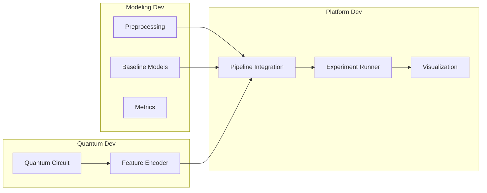
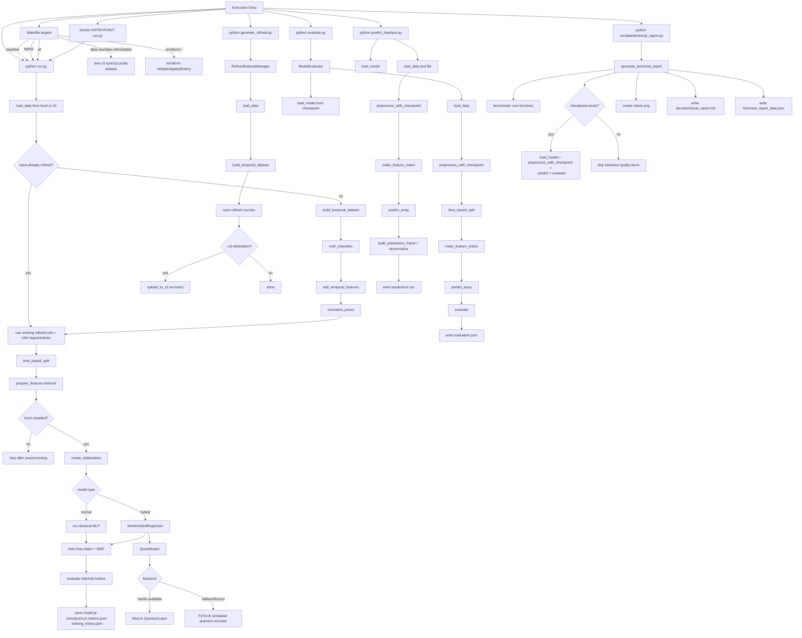

# Repository for a hybrid classical + quantum option-pricing workflow.

## Pipeline

The project is organized around the following development pipeline.



It's resulted in the following flows:
Application flowchart:


## Documentation

- [Technical Report](docs/technical_report.md)
- [Quantum Processing Notes](docs/quamtum_processing.md)

## Stage Responsibilities

### Modeling Dev
- `Preprocessing`: load market data, clean it, build features, and prepare train/validation/test splits.
- `Baseline Models`: implement classical references to compare against the hybrid approach.
- `Metrics`: define shared evaluation metrics for all experiments (for example MAE, RMSE, R2).

### Quantum Dev
- `Quantum Circuit`: design and validate the quantum circuit topology.
- `Feature Encoder`: encode classical inputs into quantum-ready features and expose them in a reusable interface.

### Platform Dev
- `Pipeline Integration`: join classical preprocessing, quantum features, and model training into one runnable flow.
- `Experiment Runner`: execute reproducible runs using config files and track outputs.
- `Visualization`: generate result plots and comparison dashboards.

## Repository Layout

Current scaffold:

```text
qig-hackathon/
|-- DATASETS/
|   |-- train.xlsx
|   |-- test_template.xlsx
|   `-- sample_Simulated_Swaption_Price.xlsx
|
|-- configs/
|   |-- baseline.yaml          # lr, epochs, model_type: linear/mlp
|   `-- hybrid.yaml            # lr, epochs, n_modes, n_photons, encoder_type
|
|-- src/
|   |-- data/
|   |   |-- __init__.py
|   |   |-- loader.py          # load_data() — reads .xlsx / .csv
|   |   |-- preprocessing.py   # melt, normalize, temporal feature engineering
|   |   `-- splits.py          # chronological train/val/test split -> DataLoaders
|   |
|   |-- classical/
|   |   |-- __init__.py
|   |   |-- linear.py          # Ridge / Linear Regression (sklearn)
|   |   `-- mlp.py             # MLP in PyTorch (main baseline)
|   |
|   |-- quantum/
|   |   |-- __init__.py
|   |   |-- circuit.py         # MerLin circuit definition (Quantum Dev)
|   |   `-- encoder.py         # encode data -> quantum input (Quantum Dev)
|   |
|   |-- hybrid/
|   |   |-- __init__.py
|   |   |-- model.py           # QRC: quantum encoder + classical readout
|   |   `-- trainer.py         # training loop, early stopping, checkpoint
|   |
|   `-- eval/
|       |-- __init__.py
|       |-- metrics.py         # MAE, RMSE, R2 — shared across all experiments
|       `-- visualize.py       # loss curves, pred vs real, term surface plots
|
|-- run.py                     # entry point: loads config, runs experiment
|-- Makefile                   # make baseline | make hybrid | make eval
`-- requirements.txt
```

Suggested mapping to the pipeline:

- `src/data` -> `Preprocessing`
- `src/classical` -> `Baseline Models`
- `src/eval` -> `Metrics` and `Visualization`
- `src/quantum` -> `Quantum Circuit` and `Feature Encoder`
- `src/hybrid` -> `Pipeline Integration` and `Experiment Runner`

---

## Recent Changes — Temporal Dynamics

The preprocessing and entry-point layers now support a full **temporal feature engineering** pipeline.

### `src/data/loader.py`
- `load_data(...)` supports both `.xlsx`/`.xls` and `.csv` files from local folders or `s3://bucket/prefix`.
- Optional date parsing on the `Date` column.
- Utility wrappers: `load_train_data(...)` and `load_test_template(...)`.

### `src/data/preprocessing.py`
- Dedicated regex to extract `tenor` and `maturity` from column names.
- Local `StandardScaler` fallback when `scikit-learn` is not installed.
- Temporal preprocessing pipeline:
  - `melt_maturities(...)` — reshapes wide to long format by maturity
  - `add_temporal_features(...)` — adds lags, diffs, returns, rolling stats
  - `normalize_prices(...)`
  - `prepare_features(...)`
  - `build_temporal_dataset(...)`
- Temporal features added:
  - Lags: `price_lag_*`
  - 1-step difference: `price_diff_1`
  - 1-step return: `price_return_1`
  - Rolling mean/std: `price_roll_mean_*`, `price_roll_std_*`
  - Time index in days: `time_idx_days`

### `src/data/splits.py`
- Chronological split by date via `time_based_split(...)`.
- `create_dataloaders(X_train, y_train, X_val, y_val, ...)` builds DataLoaders from pre-split arrays.
- PyTorch import is deferred inside the function to avoid failure when `torch` is not installed.

### `run.py`
- CLI entry point using `argparse`.
- Full temporal flow: data loading → temporal engineering → time split → X/y preparation → DataLoaders.
- Supports `--model-type normal|hybrid` to switch between classical MLP and MerLin hybrid regressor.
- Supports parallel training controls:
  - DataLoader workers (`--num-workers`, `--persistent-workers`, `--prefetch-factor`)
  - Device selection (`--device auto|cpu|cuda|mps`)
  - Optional multi-GPU training (`--data-parallel`, CUDA only)
  - CPU thread tuning (`--torch-num-threads`)
- Summary messages: features, split date, train/val sizes, batch counts.
- Graceful handling when `torch` is absent (preprocessing still runs).

---

## How To Run

### Setup

**Linux / macOS**

```bash
python -m venv .venv
source .venv/bin/activate
pip install -r requirements.txt
```

**Windows PowerShell**

```powershell
python -m venv .venv
.venv\Scripts\Activate.ps1
pip install -r requirements.txt
```

### Quick Start

```bash
python generate_refined.py --data-dir DATASETS --output-local results/refined_train.csv
python run.py --train-path results/refined_train.csv --lags 1,5,10 --rolling-windows 5,20 --val-fraction 0.2
```

```bash
python generate_refined.py --data-dir s3://raw-721094557902-us-east-1 --output-local results/refined_train.csv
python run.py --train-path results/refined_train.csv --lags 1,5,10 --rolling-windows 5,20 --val-fraction 0.2
```

> For private S3 buckets, install `boto3` and configure AWS credentials. Public buckets also work without `boto3`.

## Dataset

The public dataset bucket is organized as:

```text
s3://<DATASET_BUCKET>/
  raw/v1/        (immutable dataset)
  refined/v1/    (processed dataset, may be updated)
```

To download locally (no AWS credentials required):

```bash
make data
```

This syncs to:

```text
data/raw/
data/refined/
```

You can also run `make data-raw` or `make data-refined` to pull one split. Configure the bucket and region with `DATASET_BUCKET` and `AWS_REGION`.

## Dataset

The public dataset bucket is organized as:

```text
s3://<DATASET_BUCKET>/
  raw/v1/        (immutable dataset)
  refined/v1/    (processed dataset, may be updated)
```

To download locally (no AWS credentials required):

```bash
make data
```

This syncs to:

```text
data/raw/
data/refined/
```

You can also run `make data-raw` or `make data-refined` to pull one split. Configure the bucket and region with `DATASET_BUCKET` and `AWS_REGION`.

<<<<<<< Updated upstream
### Training Parallelism

```bash
# CPU parallelism for DataLoader
python run.py --train-path results/refined_train.csv --epochs 20 --device cpu --num-workers 4 --persistent-workers --prefetch-factor 2 --torch-num-threads 8
```

```bash
# Single-GPU training
python run.py --train-path results/refined_train.csv --epochs 20 --device cuda --num-workers 4 --pin-memory --persistent-workers
```

```bash
# Multi-GPU training (requires at least 2 CUDA GPUs)
python run.py --train-path results/refined_train.csv --epochs 20 --device cuda --data-parallel --num-workers 8 --pin-memory --persistent-workers
```

## Dataset

The public dataset bucket is organized as:

```text
s3://<DATASET_BUCKET>/
  raw/v1/        (immutable dataset)
  refined/v1/    (processed dataset, may be updated)
```

To download locally (no AWS credentials required):

```bash
make data
```

This syncs to:

```text
data/raw/
data/refined/
```

You can also run `make data-raw` or `make data-refined` to pull one split. Configure the bucket and region with `DATASET_BUCKET` and `AWS_REGION`.

### All CLI Parameters

| Parameter | Default | Description |
|---|---|---|
| `--data-dir` | `DATASETS` | Fallback dataset folder/prefix when `--train-path` is only a filename |
| `--train-path` | `results/refined_train.csv` | Training file path (local path or `s3://.../file`) |
| `--lags` | `1,5,10` | Comma-separated lag steps for temporal features |
| `--rolling-windows` | `5,20` | Comma-separated window sizes for rolling mean/std |
| `--val-fraction` | `0.2` | Fraction of data reserved for validation (chronological) |
| `--batch-size` | `32` | Batch size for DataLoaders |
| `--num-workers` | `0` | Number of parallel DataLoader worker processes |
| `--pin-memory` | `False` | Enable pinned host memory for faster CPU→GPU transfers |
| `--persistent-workers` | `False` | Keep DataLoader workers alive between epochs (requires `--num-workers > 0`) |
| `--prefetch-factor` | `2` | Number of prefetched batches per worker (`--num-workers > 0`) |
| `--device` | `auto` | Training device selection: `auto`, `cpu`, `cuda`, `mps` |
| `--data-parallel` | `False` | Enable `torch.nn.DataParallel` on multiple CUDA GPUs |
| `--torch-num-threads` | `0` | Override PyTorch CPU thread count (`0` keeps default) |
| `--epochs` | `auto` | Number of training epochs; if omitted, uses all available training batches as epochs |
| `--lr` | `0.001` | Optimizer learning rate |
| `--log-every` | `5` | Epoch interval for train/validation metric logs |
| `--model-type` | `normal` | Select model: `normal` (MLP) or `hybrid` (MerLin + head) |
| `--n-modes` | `4` | Number of photonic modes (hybrid only) |
| `--n-photons` | `2` | Number of photons (hybrid only) |
| `--quantum-depth` | `2` | Quantum trainable depth (hybrid only) |
| `--encoding-type` | `angle` | Quantum encoding (`angle` or `amplitude`) |
| `--measurement` | `probs` | MerLin measurement strategy |
| `--quantum-backend` | `merlin` | Quantum backend: `merlin`, `simulated`, or `auto` |
| `--config` | *(reserved)* | Path to a YAML config file (baseline or hybrid) |

### Optional Examples

```bash
# Baseline run with config file
python run.py --config configs/baseline.yaml

# Hybrid run with config file
python run.py --config configs/hybrid.yaml

# Custom lags and rolling windows
python run.py --data-dir DATASETS --lags 1,3,5,10,20 --rolling-windows 10,30 --val-fraction 0.15

# Hybrid run with MerLin
python run.py --model-type hybrid --quantum-backend merlin --n-modes 4 --n-photons 2 --quantum-depth 2

# Detailed training logs every epoch
python run.py --model-type hybrid --quantum-backend merlin --epochs 120 --lr 0.0005 --log-every 1

# Train directly from raw file (without refined CSV)
python run.py --train-path DATASETS/train.xlsx --model-type normal
```

### Evaluate a Saved Model

```bash
python evaluate.py --checkpoint results/checkpoint.pt --data-dir DATASETS --filename train.xlsx --val-fraction 0.2
```

### Prediction Interface

```bash
python predict_interface.py --checkpoint results/checkpoint.pt --data-dir DATASETS --filename test_template.xlsx --output results/predictions.csv
```

### Generate Refined Dataset and Upload to S3

```bash
python generate_refined.py --data-dir DATASETS --output-local results/refined_train.csv
```

```bash
python generate_refined.py --data-dir DATASETS --output-local results/refined_train.csv --s3-destination s3://raw-721094557902-us-east-1/refined/refined_train.csv --s3-format csv
```

### Using Make

```bash
make baseline
make hybrid
```

### Expected Output

```
Loaded 1000 rows from DATASETS/train.xlsx
Maturities found: [0.083, 0.166, 0.25, ...]
Temporal features added: price_lag_1, price_lag_5, price_lag_10, ...
Split date: 2049-08-01 | Train: 800 rows | Val: 200 rows
DataLoaders ready — Train batches: 25 | Val batches: 7
```

> **Note:** `--config` is reserved for future YAML-driven runs. When omitted, all parameters are taken from CLI flags. If `torch` is not installed, preprocessing and splits still run — only DataLoader creation is skipped.

---

## Implementation Checklist

- [x] Preprocessing pipeline in `src/data`
- [x] Baseline models in `src/classical`
- [x] Quantum circuit + encoder in `src/quantum`
- [x] Integrated training pipeline in `src/hybrid`
- [x] Metrics + visual reports in `src/eval`
- [x] Config-driven runs from `run.py`
