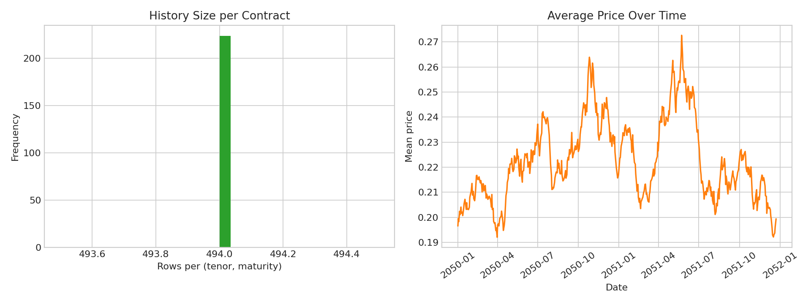
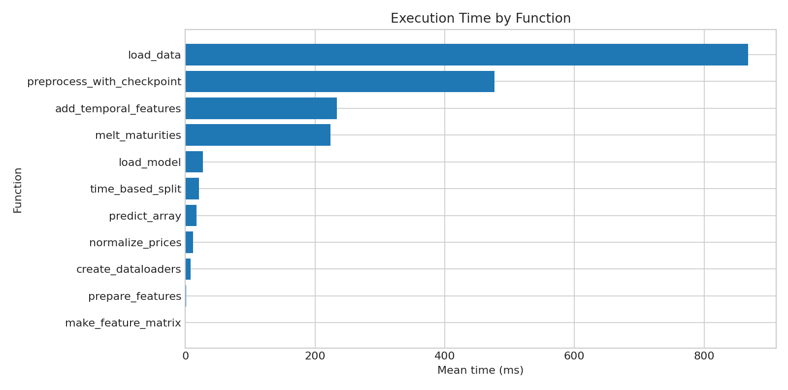
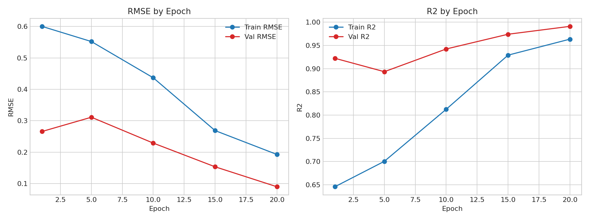
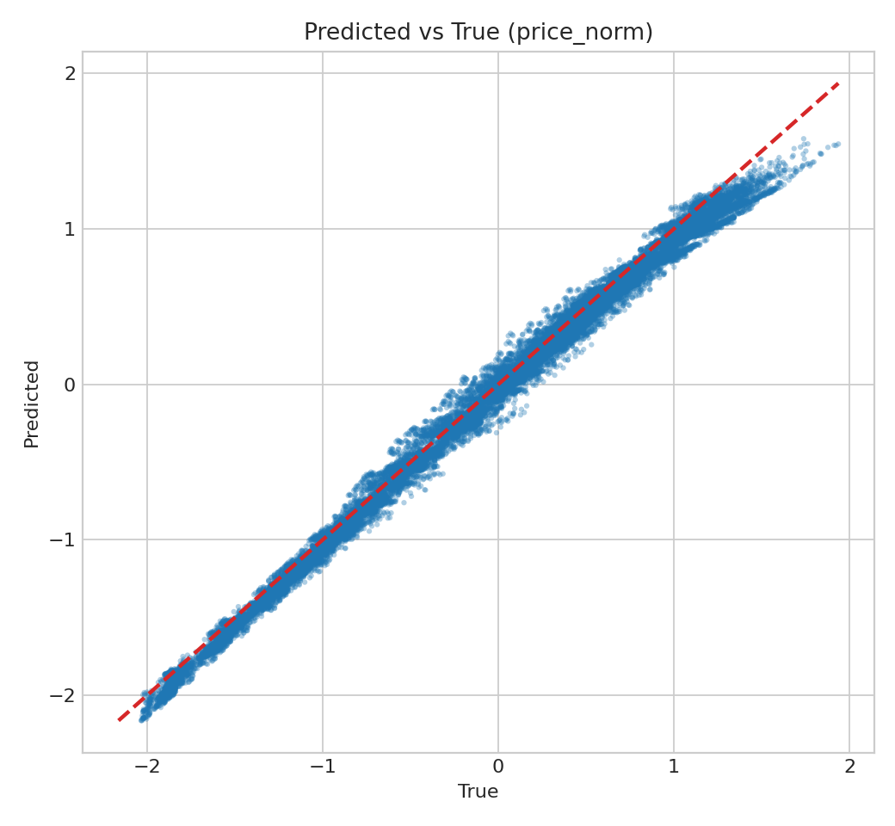
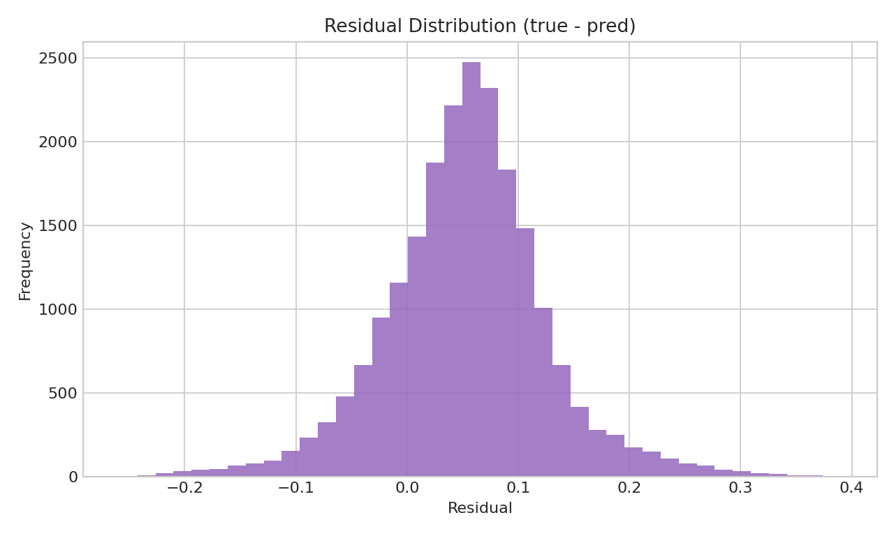

# Technical Report

Generated on 2026-03-02 22:18:55 UTC with Python 3.12.3 on Linux-6.6.87.2-microsoft-standard-WSL2-x86_64-with-glibc2.39.

## Scope

This report profiles key data/inference functions, summarizes dataset quality, and tracks model quality using current project artifacts.

## Dataset Summary

| Metric | Value |
| --- | --- |
| Raw rows | 494 |
| Raw columns | 225 |
| Long-format rows | 110656 |
| Feature rows | 106400 |
| Feature columns | 13 |
| Split date | 2051-08-07 |
| Train rows | 85120 |
| Validation rows | 21280 |
| Contracts | 224 |
| Contract history min | 494 |
| Contract history max | 494 |
| Contract history mean | 494.00 |

## Function Execution Time

| Function | Mean (ms) | Min (ms) | Max (ms) | Std (ms) | Repeats |
| --- | --- | --- | --- | --- | --- |
| load_data | 867.81 | 545.08 | 1458.27 | 418.12 | 3 |
| preprocess_with_checkpoint | 476.44 | 429.50 | 511.15 | 34.44 | 3 |
| add_temporal_features | 233.75 | 226.80 | 242.03 | 6.29 | 3 |
| melt_maturities | 224.04 | 194.16 | 282.38 | 41.26 | 3 |
| load_model | 26.95 | 26.95 | 26.95 | 0.00 | 1 |
| time_based_split | 21.40 | 18.13 | 25.87 | 3.27 | 3 |
| predict_array | 17.37 | 0.84 | 49.65 | 22.83 | 3 |
| normalize_prices | 11.91 | 9.43 | 15.42 | 2.55 | 3 |
| create_dataloaders | 7.86 | 0.16 | 22.92 | 10.65 | 3 |
| prepare_features | 1.11 | 0.72 | 1.66 | 0.40 | 3 |
| make_feature_matrix | 0.32 | 0.22 | 0.47 | 0.11 | 3 |

## Training Quality

| Metric | Value |
| --- | --- |
| History points | 5 |
| Best epoch (val RMSE) | 20 |
| Best val RMSE | 0.089786 |
| Best val R2 | 0.991138 |

## Inference Quality

| Metric | Value |
| --- | --- |
| MAE | 0.071900 |
| MSE | 0.008062 |
| RMSE | 0.089786 |
| R2 | 0.991138 |
| Residual mean | 0.053123 |
| Residual std | 0.072384 |
| |Residual| p95 | 0.177090 |

| Inference context | Value |
| --- | --- |
| Checkpoint | results/checkpoint.pt |
| Model type | normal |
| Split date | 2051-08-07 |
| Validation rows | 21280 |

## Notes

- DataLoader benchmark status: `ok`.
- Machine-readable payload: `assets/technical_report/technical_report_data.json`.
