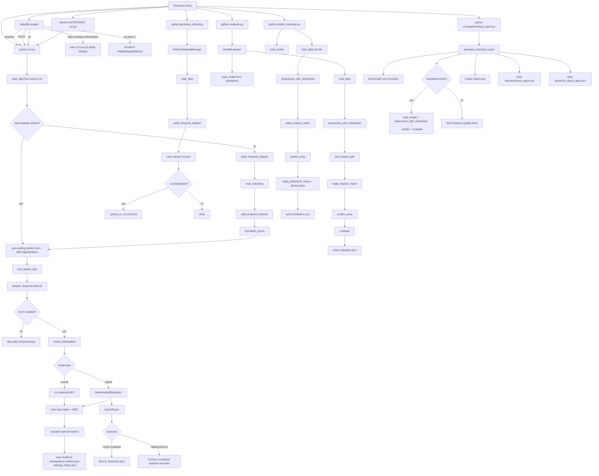

```mermaid
flowchart TD
      U[Execution Entry] --> M[Makefile targets]
      U --> D[Docker ENTRYPOINT: run.py]
      U --> R1[python run.py]
      U --> R2[python generate_refined.py]
      U --> R3[python evaluate.py]
      U --> R4[python predict_interface.py]
      U --> R5[python src/data/technical_report.py]

      M -->|baseline| R1
      M -->|hybrid| R1
      M -->|all| R1
      M -->|data-raw/data-refined/data| S3SYNC[aws s3 sync/cp public
  dataset]
      M -->|terraform-*| TF[terraform init/plan/apply/destroy]

      D --> R1

      %% Training path
      R1 --> LD[load_data from local or s3]
      LD --> Q1{Input already refined?}
      Q1 -->|yes| RF[use existing refined cols + infer lags/windows]
      Q1 -->|no| BTD[build_temporal_dataset]
      BTD --> MM[melt_maturities]
      MM --> ATF[add_temporal_features]
      ATF --> NP[normalize_prices]
      NP --> RF
      RF --> SPLIT[time_based_split]
      SPLIT --> PF[prepare_features train/val]
      PF --> TORCH{torch installed?}
      TORCH -->|no| ENDPP[stop after preprocessing]
      TORCH -->|yes| DL[create_dataloaders]
      DL --> MT{model-type}
      MT -->|normal| MLP[src.classical.MLP]
      MT -->|hybrid| HYB[MerlinHybridRegressor]
      HYB --> QENC[Quantificator]
      QENC --> QB{backend}
      QB -->|merlin available| MERLIN[MerLin QuantumLayer]
      QB -->|fallback/forced| SIM[PyTorch simulated quantum encoder]
      MLP --> TRAIN[train loop Adam + MSE]
      HYB --> TRAIN
      TRAIN --> MET[evaluate train/val metrics]
      MET --> SAVE[save model.pt checkpoint.pt metrics.json
  training_history.json]

      %% Refined dataset generation
      R2 --> RDM[RefinedDatasetManager]
      RDM --> LD2[load_data]
      LD2 --> BTD2[build_temporal_dataset]
      BTD2 --> SAVELOCAL[save refined csv/xlsx]
      SAVELOCAL --> OPTS3{--s3-destination?}
      OPTS3 -->|yes| UPS3[upload_to_s3 via boto3]
      OPTS3 -->|no| DONE2[done]

      %% Evaluation path
      R3 --> ME[ModelEvaluator]
      ME --> LM1[load_model from checkpoint]
      ME --> LD3[load_data]
      LD3 --> PWC1[preprocess_with_checkpoint]
      PWC1 --> SPLIT2[time_based_split]
      SPLIT2 --> FM1[make_feature_matrix]
      FM1 --> PRED1[predict_array]
      PRED1 --> EVAL1[evaluate]
      EVAL1 --> OUTJSON[write evaluation.json]

      %% Prediction interface
      R4 --> LM2[load_model]
      R4 --> LD4[load_data test file]
      LD4 --> PWC2[preprocess_with_checkpoint]
      PWC2 --> FM2[make_feature_matrix]
      FM2 --> PRED2[predict_array]
      PRED2 --> BPF[build_predictions_frame + denormalize]
      BPF --> OUTCSV[write predictions.csv]

      %% Technical report generation
      R5 --> TR[generate_technical_report]
      TR --> BENCH[benchmark core functions]
      TR --> CKPT{checkpoint exists?}
      CKPT -->|yes| INFQ[load_model + preprocess_with_checkpoint +
  predict + evaluate]
      CKPT -->|no| SKIPINF[skip inference quality block]
      TR --> PLOTS[create charts png]
      TR --> MD[write docs/technical_report.md]
      TR --> JSON[write technical_report_data.json]
```
